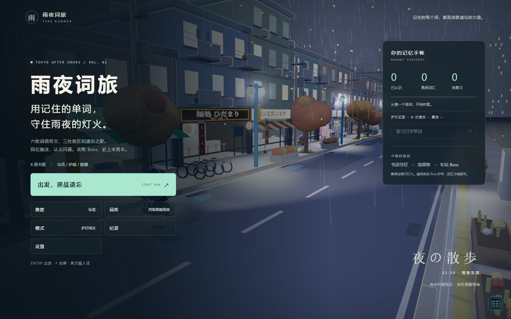
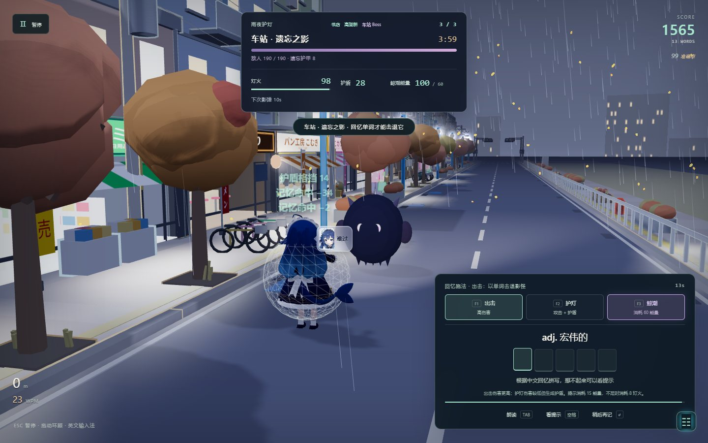
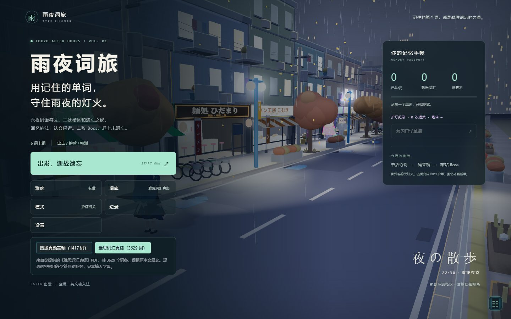
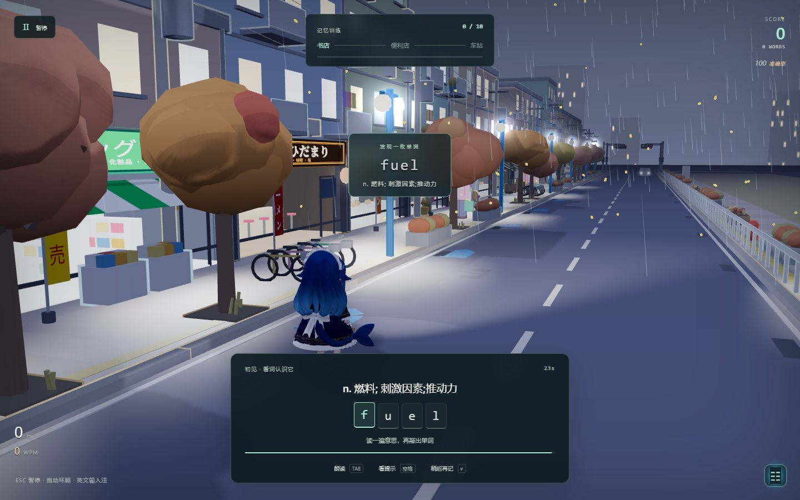
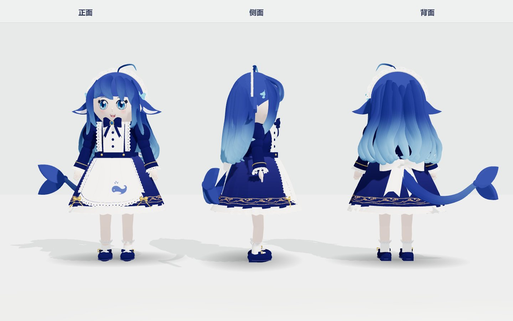

# 雨夜词旅 · TYPE RUNNER

用单词守住雨夜东京的灯火。默认“护灯闯关”把回忆拼写变成攻击、认义变成闪避，带着六词卡组击退三处影怪。保留 3D 街区、天气、昼夜系统，以及独立的词汇训练模式。



## 在线游玩（即点即玩）

- **国内入口（腾讯云）**：<https://yuye-hbjywrjkczx-d2g39jsk6f83b8d24.webapps.tcloudbase.com>
- **镜像（GitHub Pages）**：<https://wangruihan-king.github.io/yuye-type-runner/>
- 词库可选：**四级真题高频 1417 词**（按真题句频排序）与 **雅思词汇真经 3629 词**（含音标与原书序号），菜单里一键切换。

<p>
  
  
</p>
<p>
  
  
</p>

## 打开游戏

双击本目录的 `index.html` 即可，无需安装依赖。背景音乐来自同目录 `audio/`；浏览器朗读依赖系统英语语音，部分语音需要网络。推荐在桌面 Chrome 或 Edge 中使用英文输入法。

## 护灯闯关

每局选择最多 6 个不同单词，优先穿插到期复习词和新词。准备阶段显示英文与中文，看词打字认识六枚符文，每词提供 5 能量。随后依次挑战书店、高架桥和车站；战斗时角色停下迎敌，夺回街区后继续前行。

- **回忆施法**：英文隐藏，根据中文拼写。开始输入前选择“出击”或“护灯”；无错误、无提示地完成，出击基础伤害 34，护灯基础伤害 18 并获得 16 护盾。连续独立回忆提高伤害，最多额外 6 点；每次获得 22 能量。
- **词义闪避**：第二、三战每三题出现一次英文选中文题。选对获得一次自动闪避、12 能量、3 灯火，并造成 10 伤害；选错触发 14 点伤害。认义成功不等于独立拼写成功。
- **鲸潮技能**：消耗 60 能量，造成 48 伤害、提供 10 护盾，并推迟下次影弹 3 秒。能量上限 100，护盾上限 40；技能不能解除最终封印。
- **遗忘反击**：敌人按独立倒计时发射影弹，抵达角色后扣除护盾或灯火。错字扣除本题 0.75 秒；纠正后拼完只造成 12 伤害。跳过、超时或答错会留下弱词，Boss 优先考这些词，登场时把尚未找回的词变成护甲；Boss 战中新错词再加 8 点护甲，同词不重复叠加，总上限 32。独立拼对可破除护甲。
- **借阅答案**：准备阶段提示免费。战斗提示消耗 15 能量，能量不足时直接消耗 8 灯火；提示后拼完不能攻击，也不能解除封印。
- **最终封印**：Boss 血量归零后，还须独立回忆未记住或仍待纠正的词；全部已找回则抽取前三词。封印期间影弹仍会袭来，灯火归零或末班车倒计时耗尽即失败。

| 难度 | 初始灯火 | 作答总时限 | 本题时间 | 影弹伤害 |
| --- | ---: | ---: | --- | ---: |
| 入门 | 120 | 5 分 30 秒 | 标准的 1.5 倍 | 14 |
| 标准 | 100 | 4 分钟 | 拼写 9 + 字母数 × 0.75 秒；认义 7 秒 | 18 |
| 困难 | 85 | 3 分钟 | 标准的 0.75 倍 | 23 |

难度同时调整敌人血量和攻击间隔。准备、答案反馈、转场及暂停不消耗作答总时限。通关得 1 星；剩余灯火至少 60% 再得 1 星；战斗未用提示且六词全部独立回忆成功再得 1 星。最佳星级、分数和通关次数保存在本机。

## 词汇训练与记忆

菜单的“词库”可选择“四级真题高频”或“雅思词汇真经”。雅思词库来自你提供的同名 PDF，包含全部 3,629 个词条，保留原中文释义、音标和原书序号。所有游戏模式使用所选词库，选择会保存；共有单词沿用已有复习进度。短语中的空格与连字符自动补齐，只需输入字母。词库已内嵌到 `index.html`，运行时无需 PDF 或网络。

另有“记忆训练”“中文回忆”“字形练习”“听写练习”，每次最多 10 词。记忆训练先展示新词，再隐藏英文回忆；错误、跳过或使用提示的词隔几题重现，最多重试两次。

独立回忆成功后按 1、3、7、14、30 天安排复习；同局重复或提前练习不会跳过等级、推迟原复习日期。看词打字只计为字形练习，手帐中的“熟悉”需要至少三次按期回忆。闯关中的独立拼写也会保存学习记录，认义错误会将对应词标为待复习。

结束后可点击单词朗读，或复习尚未记住的词。学习记录保存在本机浏览器中；不同浏览器、不同打开地址不共享进度。内置两套词库：四级真题高频 1417 词（去重，含日常精选词与例句）与雅思词汇真经 3629 词。

## 操作

| 操作 | 按键 |
| --- | --- |
| 拼写当前词 | A–Z |
| 出击 / 护灯 / 鲸潮 | F1 / F2 / F3，或点击技能按钮 |
| 选择词义 | 1 / 2 / 3，或点击选项 |
| 重听 | Tab |
| 显示拼写提示 | 空格 |
| 跳过当前题 | Enter（战斗中有失败代价） |
| 回退一个字母 | Backspace |
| 暂停 / 继续 | Esc |
| 主菜单全屏 | F |
| 环顾 / 调整距离 | 鼠标拖动 / 滚轮 |
| 天气 / 时间 | 1–6 / 左右方向键（认义题优先使用 1–3 选答案） |

离开窗口会自动暂停。点击右下角图标可以设置天气、时间和季节。小屏幕提供英文输入框以唤起屏幕键盘。

## 修改与验证

修改 `src/` 或 `template.html` 后重新构建：

```sh
node build.mjs
node scripts/verify-learning.mjs
node scripts/verify-quest.mjs
node scripts/verify-words.mjs
```

浏览器集成验证使用本机 Chrome 和 Node 内置 CDP 客户端，无第三方依赖：

```sh
node scripts/verify-browser.mjs
node scripts/verify-browser.mjs --quest
node scripts/verify-browser.mjs --ielts --quest
```

该脚本在后台启动 Chrome，检查输入、暂停、完整训练、错词重试、持久化、小屏输入和离线入口。`--quest` 额外检查实战伤害、护盾、影弹、技能消耗、认义、Boss、胜负和手机布局；纯规则测试覆盖提示代价、弱词护甲、时限与封印条件。截图写入 `.test-artifacts/`。Chrome 路径在脚本中配置为 Windows 默认安装位置。

## 代码

- `words.js`：词库与部分例句。
- `ielts-words.js`：用户提供的《雅思词汇真经》PDF 词条、音标和来源序号；不依赖外部加载。
- `learning.js`：选词、阶段队列、错词重试与间隔复习。
- `quest-rules.js`：闯关状态、战斗资源、认义闪避、遗忘护甲与最终封印。
- `quest.js`：战况界面、立体影怪、影弹与技能效果、通关纪录。
- `typing.js`：当前目标、输入判定、计时与练习反馈。
- `main.js`：游戏模式、暂停、角色移动、菜单与小结。
- `core.js`：渲染、输入、音效与朗读。
- `character.js`：依据 `assets/whale-maid-reference.jpg` 搭建的蓝鲸女仆立体模型，包含长发渐变、蕾丝头饰、鲸鱼围裙、金色裙摆装饰、后腰蝴蝶结与鲸尾。
- `actors.js`：双腿关节求解、脚跟落地和脚尖离地、对侧手臂摆动，以及头发、裙摆和尾巴的滞后摆动。街区移动速度同步调整为步行节奏。
- `env.js`、`city.js`、`lib/refworld.js`：街区与天气。
- `template.html`、`style.css`：界面和布局。
- `build.mjs`：将源码、Three.js 与表情资源内联到入口 HTML。

角色使用可绕行观察的真实三维几何。头部按脸颊、下巴和鼻子的轮廓重新雕塑，蓝眼睛与表情贴合面部曲面；长发由层叠的 S 形渐变卷发组成。头饰、袖口、围裙与裙摆采用折叠布面和镂空蕾丝，鞋子补充鞋跟、鞋带和鞋底缝线；后腰蝴蝶结带垂落折痕，鲸尾与尾鳍连续衔接。静态细节按材质合并网格，保留关节与发束的独立运动。表情、蕾丝、刺绣和围裙图案由 Canvas 绘制，参考图保留在素材目录，游戏运行时不依赖它的加载。

运行 `node scripts/verify-browser.mjs --character` 在完整验证中增加角色检查；`node scripts/verify-browser.mjs --character-only` 只验证角色并生成预览。检查包括有限的模型边界、低于 13 万三角形的几何预算、步态脚部高度，以及施法时的手部位置。预览写入 `.test-artifacts/`：

- `character-turnaround.png`：正面、侧面和背面。
- `character-details.png`：面部头饰、领结围裙、后腰蝴蝶结与鲸尾。
- `character-actions.png`：出击、护灯和鲸潮姿势。
- `character-walk.png`：走路 APNG；`character-walk-frame.png` 为单帧预览。
